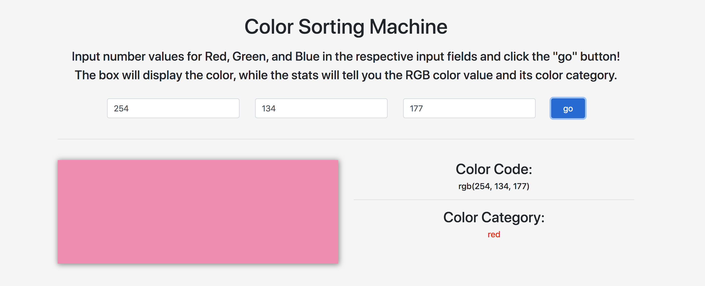

# ColorSortingMachine

## Description:
This application is a side-project for [Color-Story](https://github.com/Mleuer/Color-Story). This ColorSortingMachine allows for a user to input values for RGB colors, and see how this RGB value is categorized. Color categories are as follows:
* red (which includes pink)
* orange
* yellow
* green
* cyan
* blue
* purple
* magenta
* black
* white
* gray

---

## Usage:
Open the application (https://craindavis.github.io/ColorSortingMachine/) and do the following steps:
* __step 1:__ Input a value for red, one for green, and one for blue in the respective input fields. All values should be positive integers between 0 and 255.
* __step 2:__ Click the "go" button. This will render the box on the bottom-left to display the RGB value as a color. On the bottom right, there will be two sections to take note of:
    * the user's input in RGB color code format
    * the category it belongs to based on the algorithm

---

## Demonstration:
coming soon...

---

## Algorithm Explanation:
coming soon...

---

## Future Development:
There are likely some kinks that still need to be worked out. Following _significant_ testing, this section will be updated.

---

## Resources:
* Algorithm Development:
    * [Categorizing Colors that are in Hex values](https://www.autoitscript.com/forum/topic/114433-categorizing-colors-that-are-in-hex-values/)
    * [Google Color Picker](https://www.google.com/search?q=color+picker&oq=color+picker&aqs=chrome.0.69i59j0l5j69i60l2.1657j0j7&sourceid=chrome&ie=UTF-8)
* Application Coding:
    * [Bootstrap](https://getbootstrap.com/docs/4.4/getting-started/introduction/)
    * [jQuery](https://jquery.com/)

---

## Questions:
For any questions, contact me at:
* email: chyna.davis11@gmail.com
* GitHub: [CrainDavis](https://github.com/CrainDavis)
