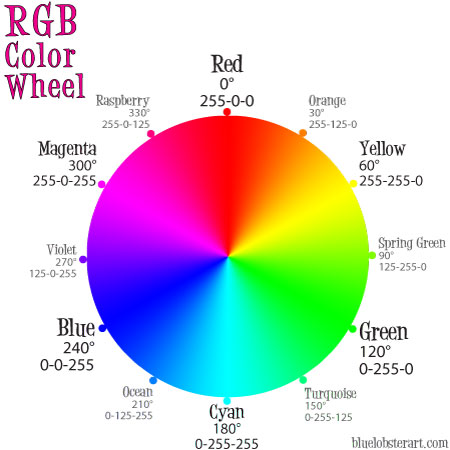
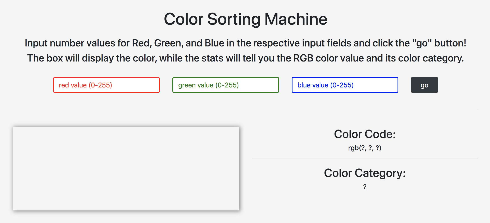
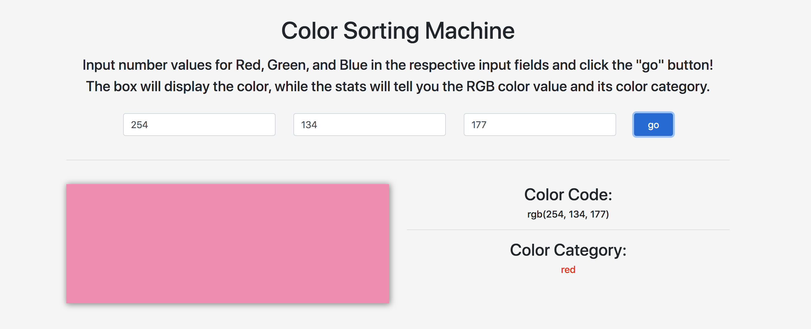

# Color Sorting Machine
   

## Description:
This application allows for a user to input values for RGB colors, and see how this RGB value is categorized. Color categories are as follows:
* red (which includes shades of pink)
* orange
* yellow
* green
* cyan
* blue
* purple
* magenta
* black
* white
* gray

The chart in [this link](http://dawnsbrain.com/the-rgb-color-wheel/), also seen below, was used for reference.

---

## Usage:
Open the application (https://craindavis.github.io/ColorSortingMachine/) and do the following steps:
* __step 1:__ Input a value for red, one for green, and one for blue in the respective input fields. All values should be positive integers between 0 and 255.
* __step 2:__ Click the "go" button. This will render the box on the bottom-left to display the RGB value as a color. On the bottom right, there will be two sections to take note of:
    * the user's input in RGB color code format
    * the category it belongs to based on the algorithm

---

## Demonstration:

---

## Algorithm Explanation:
* I first examined the user's input (three number values), and compared them to one another to determine whether the color falls under black/white/gray or not. If all RGB number values were identical (ie RGB(25, 25, 25)), then the color will fall under the black/white/gray category, depending on whether this identical number is closer to 0 or 255.
    * If the identical number is >= 0 and < 30, then the outcome will be `black`.
    * If the identical number is >= 30 and <= 240, then the outcome will be `gray`.
    * If the identical number is > 240 and <= 255, then the outcome will be `white`.
* However, because the color `gray` extends a bit outside of this black/white/gray category, I also had to find an `averageDiff` ("average difference") value for the user's three input values. This is used to determine whether the RGB value should be categorized as `gray` or as a color other than black/white/gray. This `averageDiff` value is calculated as such using the user's three input numbers:
    * (`var redGreenDiff = Math.abs(redNum - greenNum);`): the absolute (non-negative) difference between the `red` and `green` values
    * (`var greenBlueDiff = Math.abs(greenNum - blueNum);`): the absolute (non-negative) difference between the `green` and `blue` values
    * (`redBlueDiff = Math.abs(redNum - blueNum);`): the absolute (non-negative) difference between the `red` and `blue` values
    * (`var averageDiff = (redGreenDiff + greenBlueDiff + redBlueDiff) / 3;`): the average difference is the sum of the three above values, divided by three.
    * For example, if the user's input RGB value is __RGB(204, 63, 177)__, then the `redGreenDiff` is __144__, the `greenBlueDiff` is __114__, the `redBlueDiff` is __27__, and the `averageDiff` is __95__.
If this `averageDiff` value is less than __10__, then the user's input RGB color is categorized as `gray`.
* If this `averageDiff` value is greater than or equal to __10__, then another variable needs to be created: the average of the three user values, called `averageColor`. This is also used to determine whether the user's input color is black/white/gray or not. An "`averageColor` value" is defined as the value of the user's red, green, and blue input numbers added together and divided by three. For example, if the value __RGB(148, 219, 27)__ is entered, the "`averageColor` value" is (148 + 219 + 27) / 3, which equals __131.33__.
    * If this `averageColor` value is >= 0 but <= 30, then the color category is determined to be `black`.
    * If it is >= 240 and <= 255, then the color category is `white`.
    * However, if the `averageColor` value is between 30 and 240, then the resulting categorization will be a color other than black/white/gray. Thus, there is a need to examine the user's three input values, comparing them both each other and to a set of 12 _"base colors"_.

* By using __omikron48__'s advice from [this forum response](https://www.autoitscript.com/forum/topic/114433-categorizing-colors-that-are-in-hex-values/), (`Get the difference of the color's RGB values from the RGB values of your 6 base colors, sum them up then choose the one with the lowest difference?`) I first created a set of 12 (rather than 6) _"base colors"_ based on the following color wheel chart seen at the top of this README, and arranged them as a 2D array (an array of arrays):
    * __red__ = RGB(255, 0, 0)
    * __orange__ = RGB(255, 125, 0)
    * __yellow__ = RGB(255, 255, 0)
    * __yellow-green__ = RGB(125, 255 0)
    * __green__ = RGB(0, 255, 0)
    * __turquoise__ = RGB(0, 255, 125)
    * __cyan__ = RGB(0, 255, 255)
    * __aqua__ = RGB(0, 125, 255)
    * __blue__ = RGB(0, 0, 255)
    * __violet__ = RGB(125, 0, 255)
    * __magenta__ = RGB(255, 0, 255)
    * __pink__ = RGB(255, 0, 125)

* For the rest of the explanation, I will be using the value __RGB(245, 26, 111)__ as the user's input value. This value will be categorized as a color other than black/white/gray, as the `averageDiff` (which is __146__) is greater than 10, and the `averageColor` (which is __127.33__) is between 30 and 240.
* I then compared this user input RGB value to each value in the base color 2D array and generated a `colorDifferences` array (see explanation below).
    * user input value: __RGB(245, 26, 111)__
    * base color 2D array (replace the color labels with the RGB values above): `const trueROYLGTCABVMP = [ [red], [orange], [yellow], [yellow-green], [green], [turquoise], [cyan], [aqua], [blue], [violet], [magenta], [pink] ];`
    * generated `colorDifferences` array: `[147, 220, 350, 460, 585, 488, 618, 488, 415, 290, 180, 50]`
* Explanation on how to generate the `colorDifferences` array:
    * First I compare the user's RGB(R?, G?, B?) value to _each_ of the values in the `trueROYLGTCABVMP` base colors array.
    * The user's input (__RGB(245, 26, 111)__) is first compared to the base __red__ color (__RGB(255, 0, 0)__). I find the absolute (non-negative) difference between each corresponding red, green, and blue value. The `diffRed` value (difference between each of the red values) is __10__ (absolute value of 245 - 255), the `diffGreen` value (difference between each of the green values) is __26__ (absolute value of 26 - 0), and the `diffBlue` (difference between each of the blue values) is __111__ (absolute value of 111 - 0).
    * Using this __(10, 26, 111)__ value from the three differences, I then calculate a `differenceSum` value by adding these three RGB values together. The result is __147__, which corresponds to the first value in the `colorDifferences` array. 
* I repeat the process for the remaining 11 values.

* The next step is to find out which of the 12 numbers in the `colorDifferences` array is the smallest. In the case of this explanation, it is __50__, the last number in the array (index of 11). Based on the index number of this lowest value, the color category is determined. (_note_: "red" is listed twice; the second instance corresponds to the "pink" value, but I have chosen to categorize all "pink" values as shades of "red" for the sake of simplicity and my sanity.)
    * if lowest number = index 0: `colorCategory` = "red"
    * if lowest number = index 1: `colorCategory` = "orange"
    * if lowest number = index 2: `colorCategory` = "yellow"
    * if lowest number = index 3: `colorCategory` = "yellowgreen"
    * if lowest number = index 4: `colorCategory` = "green"
    * if lowest number = index 5: `colorCategory` = "turquoise"
    * if lowest number = index 6: `colorCategory` = "cyan"
    * if lowest number = index 7: `colorCategory` = "aqua"
    * if lowest number = index 8: `colorCategory` = "blue"
    * if lowest number = index 9: `colorCategory` = "purple"
    * if lowest number = index 10: `colorCategory` = "magenta"
    * if lowest number = index 11: `colorCategory` = "red"
* As a result, the user input value (__RGB(245, 26, 111)__) is categorized as "red".

* However, I also came across instances where the lowest number in the `colorDifferences` array appeared twice, causing issues with the algorithm this far. As a result, I needed to also consider how to categorize an RGB value if it was determined to have two equal "lowest values". 
    * Take, for example, the RGB value __RGB(75, 119, 63)__: the algorithm thus far will categorize this value as "orange", even though it is actually "green". 
    * If we look at the `colorDifferences` array `[362, 249, 379, 249, 274, 273, 403, 273, 386, 361, 491, 361]`, we see that the values at index 1 and index 3 are both __249__.
    * _note_: the values at index 5 and index 7 are also identical (__273__), but because this is greater than __249__, it is disregarded entirely. 
    * The above algorithm finds the _first instance_ of the lowest number at sets that as the color category, creating an apparent error. Thus, the algorithm needs to be updated.
* First, I go through the `colorDifferences` array and check to see if there are two "lowest numbers". If there are not, then the algorithm proceeds to categorize the user's input using the singular lowest value as previously explained. But if there are two "lowest values", then the following is done:
    * Take the user's original three RGB input values, check to see if any of them are the same, and lastly compare to the remaining value.
        * If the red and green values are identical:
            * If the blue value is _less than_ red and green values: `colorCategory` = "yellow"
            * If the blue value is _greater than_ the red and green values: `colorCategory` = "blue"
        * If the green and blue values are identical:
            * If the red value is _less than_ green and blue values: `colorCategory` = "green"
            * If the red value is _greater than_ the green and blue values: `colorCategory` = "red"
        * If the red and blue values are identical:
            * If the green value is _less than_ red and blue values: `colorCategory` = "red"
            * If the green value is _greater than_ the red and blue values: `colorCategory` = "green"
        * If all three RGB values are different, then arrange the three values in order from largest to smallest, and determine the color based on the order:
            * Red > Green > Blue: `colorCategory` = "orange"
            * Red > Blue > Green: `colorCategory` = "red"
            * Green > Red > Blue: `colorCategory` = "green"
            * Green > Blue > Red: `colorCategory` = "green"
            * Blue > Green > Red: `colorCategory` = "blue"
            * Blue > Red > Green: `colorCategory` = "purple"

* Unfortunately, this algorithm cannot take into account all the possible RGB color combinations, leading to possible errors. In addition, color categories can also be quite subjective, so not every result will be accurate according to everyone (see [Future Development](#future-development)) below. If you have any questions or concerns, please notify of an issue and/or contact me at my email address.

---

## Future Development:
There are some kinks that still need to be worked out. Following _significant_ testing, this section and the code will be updated.
* the colors "black", "white", and "gray" are a bit subjective, both between each other and with shades/tints of the other `ROYLGTCABVMP` colors.
* the difference between "red", "magenta", and "purple" is _quite_ subjective
    * a pink-ish color can be categorized as any of the above depending on how it gets sorted in the algorithm, and the outcome can be debatable
* the range of "green" and "blue" are each quite large compared to "red"

---

## Resources:
* Algorithm Development:
    * ["Categorizing Colors that are in Hex values" -- Autoit General Help and Support](https://www.autoitscript.com/forum/topic/114433-categorizing-colors-that-are-in-hex-values/)
    * ["The RGB Color Wheel" -- Blue Lobster Art](http://dawnsbrain.com/the-rgb-color-wheel/)
    * [Google Color Picker](https://www.google.com/search?q=color+picker&oq=color+picker&aqs=chrome.0.69i59j0l5j69i60l2.1657j0j7&sourceid=chrome&ie=UTF-8)
* Application Coding:
    * [Bootstrap](https://getbootstrap.com/docs/4.4/getting-started/introduction/)
    * [jQuery](https://jquery.com/)

---

## Questions:
For any questions, contact me at:
* email: chyna.davis11@gmail.com
* GitHub: [CrainDavis](https://github.com/CrainDavis)
