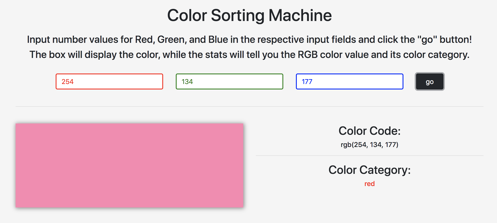

# ColorSortingMachine

## Description:
This application is a side-project for [Color-Story](https://github.com/Mleuer/Color-Story). This ColorSortingMachine allows for a user to input values for RGB colors, and see how this RGB value is categorized. Color categories are as follows:
* red (which includes pink)
* orange
* yellow
* green
* cyan
* blue
* purple
* magenta
* black
* white
* gray

The chart in [this link](http://dawnsbrain.com/the-rgb-color-wheel/), also seen below, was used for reference.

---

## Usage:
Open the application (https://craindavis.github.io/ColorSortingMachine/) and do the following steps:
* __step 1:__ Input a value for red, one for green, and one for blue in the respective input fields. All values should be positive integers between 0 and 255.
* __step 2:__ Click the "go" button. This will render the box on the bottom-left to display the RGB value as a color. On the bottom right, there will be two sections to take note of:
    * the user's input in RGB color code format
    * the category it belongs to based on the algorithm

---

## Demonstration:

---

## Algorithm Explanation:
* I first examined the user's input (three number values), and compared them to one another to determine whether the color falls under black/white/gray or not. If all RGB number values were identical (ie RGB(25, 25, 25)), then the color will fall under the black/white/gray category, depending on whether this identical number is closer to 0 or 255.
    * If the identical number is >= 0 and < 30, then the outcome will be `black`.
    * If the identical number is >= 30 and <= 240, then the outcome will be `gray`.
    * If the identical number is > 240 and <= 255, then the outcome will be `white`.
* However, because the color `gray` extends a bit outside of this black/white/gray category, I also had to find an `averageDiff` ("average difference") value for the user's three input values. This is used to determine whether the RGB value should be categorized as `gray` or as a color other than black/white/gray. This `averageDiff` value is calculated as such using the user's three input numbers:
    * (`var redGreenDiff = Math.abs(redNum - greenNum);`): the absolute (non-negative) difference between the `red` and `green` values
    * (`var greenBlueDiff = Math.abs(greenNum - blueNum);`): the absolute (non-negative) difference between the `green` and `blue` values
    * (`redBlueDiff = Math.abs(redNum - blueNum);`): the absolute (non-negative) difference between the `red` and `blue` values
    * (`var averageDiff = (redGreenDiff + greenBlueDiff + redBlueDiff) / 3;`): the average difference is the sum of the three above values, divided by three.
    * For example, if the user's input RGB value is __RGB(204, 63, 177)__, then the `redGreenDiff` is __144__, the `greenBlueDiff` is __114__, the `redBlueDiff` is __27__, and the `averageDiff` is __95__.
If this `averageDiff` value is less than __10__, then the user's input RGB color is categorized as `gray`.
* If this `averageDiff` value is greater than or equal to __10__, then another variable needs to be created: the average of the three user values, called `averageColor`. This is also used to determine whether the user's input color is black/white/gray or not. An "`averageColor` value" is defined as the value of the user's red, green, and blue input numbers added together and divided by three. For example, if the value __RGB(148, 219, 27)__ is entered, the "`averageColor` value" is (148 + 219 + 27) / 3, which equals __131.33__.
    * If this `averageColor` value is >= 0 but <= 30, then the color category is determined to be `black`.
    * If it is >= 240 and <= 255, then the color category is `white`.
    * However, if the `averageColor` value is between 30 and 240, then the resulting categorization will be a color other than black/white/gray.
* By using __omikron48__'s advice from [this forum response](https://www.autoitscript.com/forum/topic/114433-categorizing-colors-that-are-in-hex-values/), (`Get the difference of the color's RGB values from the RGB values of your 6 base colors, sum them up then choose the one with the lowest difference?`) I first created a set of 12 _"base colors"_ based on the following color wheel chart seen at the top of this README:
    * red (255, 0, 0)
    * orange (255, 125, 0)
    * yellow (255, 255, 0)
    * yellow-green (125, 255 0)
    * green (0, 255, 0)
    * turquoise (0, 255, 125)
    * cyan (0, 255, 255)
    * aqua (0, 125, 255)
    * blue (0, 0, 255)
    * violet (125, 0, 255)
    * magenta (255, 0, 255)
    * pink (255, 0, 125)

---

## Future Development:
There are likely some kinks that still need to be worked out. Following _significant_ testing, this section will be updated.
* the color "gray" is a bit subjective
* the difference between "red", "magenta", and "purple" is not well-defined
    * a pink-ish color can be categorized as any of the above depending on how it gets sorted in the algorithm, and the outcome can be debatable
* the range of "green" and "blue" are each quite large compared to "red"

---

## Resources:
* Algorithm Development:
    * ["Categorizing Colors that are in Hex values" -- Autoit General Help and Support](https://www.autoitscript.com/forum/topic/114433-categorizing-colors-that-are-in-hex-values/)
    * ["The RGB Color Wheel" -- Blue Lobster Art](http://dawnsbrain.com/the-rgb-color-wheel/)
    * [Google Color Picker](https://www.google.com/search?q=color+picker&oq=color+picker&aqs=chrome.0.69i59j0l5j69i60l2.1657j0j7&sourceid=chrome&ie=UTF-8)
* Application Coding:
    * [Bootstrap](https://getbootstrap.com/docs/4.4/getting-started/introduction/)
    * [jQuery](https://jquery.com/)

---

## Questions:
For any questions, contact me at:
* email: chyna.davis11@gmail.com
* GitHub: [CrainDavis](https://github.com/CrainDavis)
